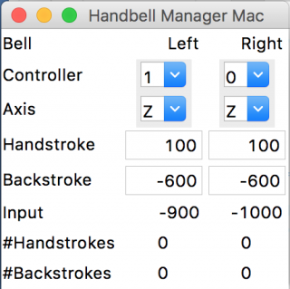

# Handbell Manager for Mac

Handbell Manager for Mac is an input controller or "driver" that lets you use eBells, or other motion controllers such as the ActionXL, with handbell simulator programs such as Mabel or Ringing Room.

You can find a blog post about this software [here](https://www.handbellringing.co.uk/blog/handbell-manager-for-mac).

## Installation

### Using the standalone executable

Download HandbellManagerMac.zip, unzip it, and move it to your Applications folder. Double click to launch it.

You will probably need to adjust your security settings to allow Handbell Manager to send keystrokes to the ringing application that you are using.

Go into System Preferences, then Security & Privacy, then into the Privacy tab.

Click on Accessibility and you should see a list with options to allow certain apps to control your computer. Use the + button to add Terminal, IDLE3 and HandbellManagerMac to the list. 

### Installing manually

If the executable doesn't work for you, you can try installing manually. This might be necessary if you have the most recent MacOS (Big Sur).

1. Make sure your Mac has a recent enough version of MacOS: at least 10.13 (High Sierra).
2. Install the latest version of Python. At the time of writing this is 3.9.1. Find it at www.python.org.
3. Install Homebrew. Find it at brew.sh
4. In a Terminal window, type brew install sdl sdl_image sdl_mixer sdl_ttf portmidi
5. In a Terminal window, type pip3 install pygame==1.9.6 (if you have a recent Mac with the M1 chip, just try pip3 install pygame). If pip3 doesn't work, just use pip.
6. In a Terminal window, type pip3 install pynput 
7. Download HandbellManagerMac.py and save it somewhere.

## Usage

1. Plug in your eBells.
2. If you have the executable, double-click to launch it.
3. If you installed manually, control-click on HandbellManagerMac.py and select "Open with IDLE 3.9.1" (or whatever your version of IDLE is). Select "Run Module" from the "Run" menu.

That should run Handbell Manager for Mac. You should see a window that looks like this:

To use it once it's running:

1. Set the Left and Right controllers so that they are the right way around.
2. Set the Axis options to whatever you would use in single-axis mode in Handbell Stadium.
3. Set the Handstroke and Backstroke values to whatever you would use in Handbell Stadium.
4. Swinging the controllers should result in #Handstrokes and #Backstrokes counting upwards.
5. Focus on the window of the application that you want to ring in: Mabel, or a browser with Ringing Room.
6. Swinging the controllers should cause your simulated bells to sound. If using Mabel, make sure you don't have up/down key action selected (this is in Preferences / Ringing).

## License

BSD 3-Clause license.

## Author

Handbell Manager for Mac is written by [Simon Gay](https://github.com/SimonGay).

The project home page is <https://github.com/SimonGay/HandbellManagerMac>.
