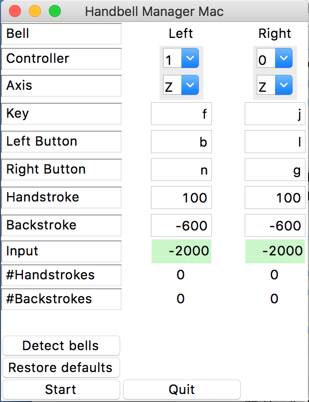

# Handbell Manager for Mac

Handbell Manager for Mac is an input controller or "driver" that lets you use motion controllers such as the ActionXL with handbell simulator programs such as Mabel or Handbell Stadium.

You can find a blog post about this software [here](https://www.handbellringing.co.uk/blog/handbell-manager-for-mac).

## Installation

### Installing with Homebrew

The easiest way to install Handbell Manager for Mac is with [Mac Homebrew](https://brew.sh).

```bash
brew install bellringers/bellringing/handbellmanagermac
```

### Installing manually

To install manually:

1. Install Python 3.8.
2. Somehow install these other programs: sdl sdl_image sdl_mixer sdl_ttf portmidi
3. Install the Python dependencies using pip or Anaconda.

```bash
pip3 install pygame pynput
```

## Usage

1. Plug in your controllers
2. Open a Terminal and run the command `handbell-manager` to launch Handbell Manager for Mac.

That should run Handbell Manager for Mac. You should see a window that looks like this:



To use it once it's running:

1. Set the Left and Right controllers so that they are the right way around.
2. Set the Axis options to whatever you would use in single-axis mode in Handbell Stadium.
3. Set the Handstroke and Backstroke values to whatever you would use in Handbell Stadium.
4. Swinging the controllers should result in #Handstrokes and #Backstrokes counting upwards.
5. Focus on the window of the application that you want to ring in: Mabel, or a browser with Ringing Room.
6. Swinging the controllers should cause your simulated bells to sound. If using Mabel, make sure you don't have up/down key action selected (this is in Preferences / Ringing).

## License

BSD 3-Clause license.

## Author

Handbell Manager for Mac is written by [Simon Gay](https://github.com/SimonGay).
Packaging support was added by [Andrew Janke](https://apjanke.net).

The project home page is <https://github.com/SimonGay/HandbellManagerMac>.
